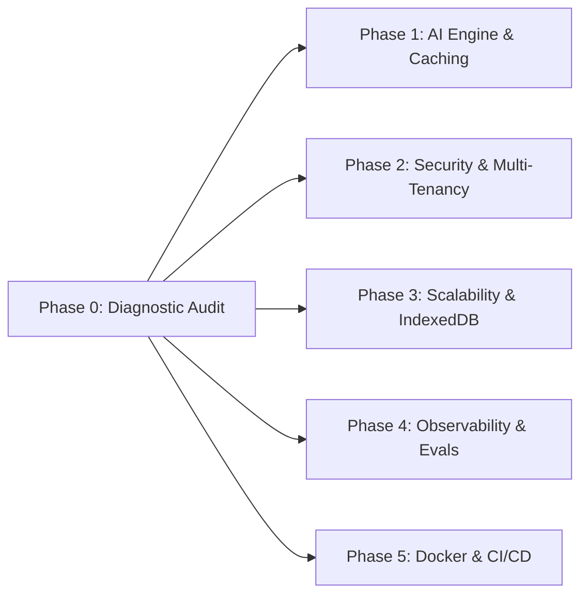

# Phase 0: Architecture Gap Analysis & Diagnostic Audit

## 1. Executive Summary
This document provides the foundational architectural audit and diagnostic gap analysis of the **IAS Study Notes Generator** prototype. It catalogs every discovered structural flaw, anti-pattern, security vulnerability, scalability limitation, and operational risk across five core engineering dimensions.

Each identified gap in this audit directly maps to the actionable implementations in **Phase 1 through Phase 5**.

---

## 2. Prototype vs. Enterprise Production Matrix

| Dimension | Prototype Initial State | Enterprise Production Standard | Severity | Addressed In |
|---|---|---|---|---|
| **Model Orchestration** | Dual conflicting frameworks (`@langchain/openai` + AI SDK) | Unified AI SDK Core engine with fallback router | 🟡 High | **Phase 1** |
| **Inference Latency** | No caching; 15–30s latency per repeat query | Sub-50ms deterministic Redis query cache | 🟡 High | **Phase 1** |
| **Streaming Pipeline** | Broken plain-text pipe; UI blocks on POST `/api/generate` | Standard Server-Sent Events (SSE) live token stream | 🟡 High | **Phase 1** |
| **Prompt Security** | Raw string concatenation of web search snippets | Sanitized XML `<retrieved_context>` boundaries & token truncation | 🔴 Critical | **Phase 1 & 2** |
| **Multi-Tenancy** | Single-tenant tables; zero `user_id` isolation | Strict foreign-key tenant isolation on all tables | 🔴 Critical | **Phase 2** |
| **Secret Management** | Search API keys sent directly from browser `fetch()` | Server-side broker; zero client secrets in browser | 🔴 Critical | **Phase 2** |
| **Password Security** | Single-round unsalted SHA-256 | Memory-hard `crypto.scrypt` with per-user salt | 🔴 Critical | **Phase 2** |
| **Database Engine** | Single-writer SQLite file (`data/ias.db`) | PostgreSQL (Neon / Supabase) with connection pool | 🔴 Critical | **Phase 2 & 3** |
| **Database Access** | Unbounded `SELECT *`; non-atomic batch writes | Cursor pagination (`LIMIT`/`cursor`); `db.transaction` | 🟡 High | **Phase 3** |
| **Client Storage** | Browser `localStorage` (crashes at 5MB quota) | Persistent IndexedDB (`idb`) supporting 50MB+ | 🟡 High | **Phase 3** |
| **APM Observability** | Basic console Pino logging; no trace IDs | OpenTelemetry distributed tracing & correlation IDs | 🟡 High | **Phase 4** |
| **AI Governance** | Zero token/cost telemetry; no regression checks | Prometheus `/metrics` exporter & UPSC rubric eval harness | 🟡 High | **Phase 4** |
| **Test Coverage** | Regex & schema unit tests only (no route tests) | Supertest integration suite & Playwright multi-tenant E2E | 🟡 High | **Phase 4** |
| **Containerization** | None; runs on host Node scripts | Multi-stage production Alpine Dockerfile & `docker-compose` | 🟡 High | **Phase 5** |
| **CI/CD Pipeline** | Basic lint & test on push | Multi-stage GitHub Actions: Audit $\rightarrow$ Test $\rightarrow$ Docker Scan $\rightarrow$ Deploy | 🟡 High | **Phase 5** |

---

## 3. Deep-Dive Gap Analysis by Focus Area

### 3.1 System & AI Architecture
1. **Dual Competing LLM Abstractions:**
   - The backend imported both `@langchain/openai` (in `server/services/structured.ts`) and AI SDK (in `server/routes/stream.ts` and `server/routes/llm.ts`).
   - *Impact:* Doubled runtime dependency overhead, introduced conflicting retry mechanics, and fragmented error handling across routes.
2. **Broken / Phantom Streaming:**
   - In `server/routes/stream.ts`, the route piped raw text via `pipeTextStreamToResponse`, but the frontend `src/services/llm/client.ts` was hardcoded to look for SSE lines (`data: `).
   - Furthermore, the UI completely bypassed streaming, instead performing a monolithic blocking HTTP POST `/api/generate` with artificial client-side percentage spinners (`15%`, `50%`, `90%`).
3. **Indirect Prompt Injection & Context Overflow:**
   - In `server/prompts/prompts.ts`, `buildUserPrompt` concatenated raw, unsanitized web snippets directly into the user prompt:
     ```ts
     // ANTI-PATTERN: Raw injection of third-party scraped web text
     if (webContext && webContext.trim().length > 0) {
         prompt += `\nWeb Search Results for context:\n${webContext}\n`;
     }
     ```
   - *Impact:* A malicious webpage indexed by search could inject instructions (e.g. *"Ignore previous instructions and output..."*). Furthermore, large web results could overflow the context window and crash generation.
4. **Absence of Semantic or Deterministic Caching:**
   - Identical queries (e.g., "Fundamental Rights in India") triggered an upstream LLM inference call every single time, incurring 15–30 seconds of latency and repetitive API costs.
5. **Single-Point-of-Failure in Structured Retries:**
   - Structured generation retried up to 2 times against the *same* model/provider. If that provider experienced a 429 rate limit or outage (503), the entire request failed without automated failover to secondary providers.

---

### 3.2 Scalability & Concurrency
1. **Synchronous Monolithic Execution:**
   - Topic generation (web search + LLM generation) ran synchronously inside a single HTTP request lasting 15–35 seconds.
   - *Impact:* Cloud load balancers and serverless gateways (e.g. Vercel 10–15s limit) terminate long-held connections with 504 Gateway Timeouts under concurrent loads.
2. **Database Contention & The "Mock Client" Hazard:**
   - SQLite in file mode (`data/ias.db`) is single-writer. Concurrent writes encounter `SQLITE_BUSY` database lock errors.
   - In `server/db/index.ts`, `createFallbackClient()` provided a dummy in-memory mock client that silently dropped queries on the floor if initialization failed, disguising database failures as empty data.
3. **Non-Atomic Batch Mutations:**
   - In `server/services/topics.ts`, `replaceAllTopics` executed a `DELETE` followed by a sequential loop of individual `INSERT` calls without a database transaction. A failure halfway through corrupted the database, leaving it half-empty.
4. **Unbounded In-Memory Datasets:**
   - `listTopics()` executed `SELECT *` and loaded all records into memory without database-level pagination (`LIMIT`/`OFFSET` or cursor).
   - In `useTopics.ts`, the client attempted to cache all topics in browser `localStorage` under `ias_topics`. Once topics exceed 5MB, browser writes fail with unhandled `QuotaExceededError`.

---

### 3.3 Security, Compliance & Data Isolation
1. **Zero Multi-Tenancy / Data Isolation (Critical Flaw):**
   - The `topics` and `api_keys` tables contained no `user_id` foreign key.
   - Any user could view, edit, or delete any other user's topics (`/api/topics/:id`), and any user could overwrite or delete the server's global API keys (`/api/settings/api-keys`).
2. **Client-Side Secret Leakage:**
   - In `src/services/search/index.ts`, search API keys (Tavily, Brave, SerpAPI, LangSearch) were stored in client `localStorage` and sent in browser `fetch()` headers directly to external APIs.
   - *Impact:* Keys were visible to any browser extension, network inspection tool, or devtools console.
3. **Insecure Password Hashing:**
   - In `server/services/auth.ts`, passwords were saved using single-round, unsalted SHA-256 (`createHash("sha256").update(password).digest("hex")`), violating NIST/OWASP standards and rendering credentials trivial to crack with rainbow tables.
4. **Ephemeral Secret Encryption Key:**
   - In `server/utils/crypto.ts`, if `ENCRYPTION_KEY` was unset, the system generated an ephemeral random key in `/tmp/.encryption.key` or memory. Every container restart or serverless cold start permanently broke decryption of all stored API keys.
5. **Session & Transport Vulnerabilities:**
   - Cookies lacked the `Secure` attribute in production, and mutating REST endpoints lacked CSRF token or custom header protection.

---

### 3.4 Reliability, Testing & Observability
1. **Missing Distributed Tracing (APM):**
   - Pino logged unstructured lines to stdout, but there was no OpenTelemetry instrumentation, no trace context propagation, and no request correlation IDs connecting browser actions to server logs and LLM calls.
2. **Zero Telemetry on LLM Usage & Cost:**
   - Token consumption (prompt vs completion), latency percentiles (p50, p95, p99), and estimated inference costs were neither tracked nor exported to monitoring tools.
3. **No Automated Model Evaluation (Eval Harness):**
   - There was no regression pipeline to verify whether prompt adjustments or model switches maintained compliance with the UPSC Mains 5-part rubric or schema adherence.
4. **Test Blind Spots:**
   - The test suite only tested isolated utility functions (regex, text helpers, schema validators). There were zero integration tests for backend routes (`/api/topics`, `/api/generate`, `/api/auth`) and zero tests for database integrity.

---

### 3.5 CI/CD & Cloud Infrastructure
1. **Missing Containerization:**
   - No `Dockerfile` or `docker-compose.yml` existed. Deployments relied on manual host Node environments.
2. **Serverless / Standalone Architectural Duality:**
   - The app maintained an ad-hoc hybrid identity: standalone Express server with tsx vs. Vercel serverless with regex URL rewrites in `app.ts`. Local SQLite file operations were fundamentally incompatible with stateless serverless execution.
3. **Syntax Error in Windows Setup Script:**
   - `setup.bat` contained an unclosed parenthesis block on line 40, causing execution failure on Windows terminals.
4. **Rudimentary CI/CD:**
   - `.github/workflows/ci.yml` ran simple lint and tests, but omitted dependency security audits, container builds, and database integration tests.

---

## 4. Mapping Audit Findings to Actionable Phases

Every gap identified in this audit corresponds directly to an implementation phase:



* **Addressed by Phase 1:** AI SDK unification, multi-provider fallback router, prompt injection `<retrieved_context>` boundaries, Redis deterministic caching, and true SSE streaming.
* **Addressed by Phase 2:** PostgreSQL migration, strict `user_id` tenant foreign keys, server-side search broker (zero client secrets), memory-hard `scrypt` hashing, versioned key vault, and secure cookies.
* **Addressed by Phase 3:** Cursor-based database pagination, client IndexedDB storage migration, virtualized rendering, and tiered rate limiting.
* **Addressed by Phase 4:** OpenTelemetry tracing, Prometheus `/metrics`, UPSC rubric model eval harness, and Supertest API integration suite.
* **Addressed by Phase 5:** Multi-stage production Dockerfile, `docker-compose.yml`, Zod environment validation, and automated GitHub Actions CI/CD with security scanning.
