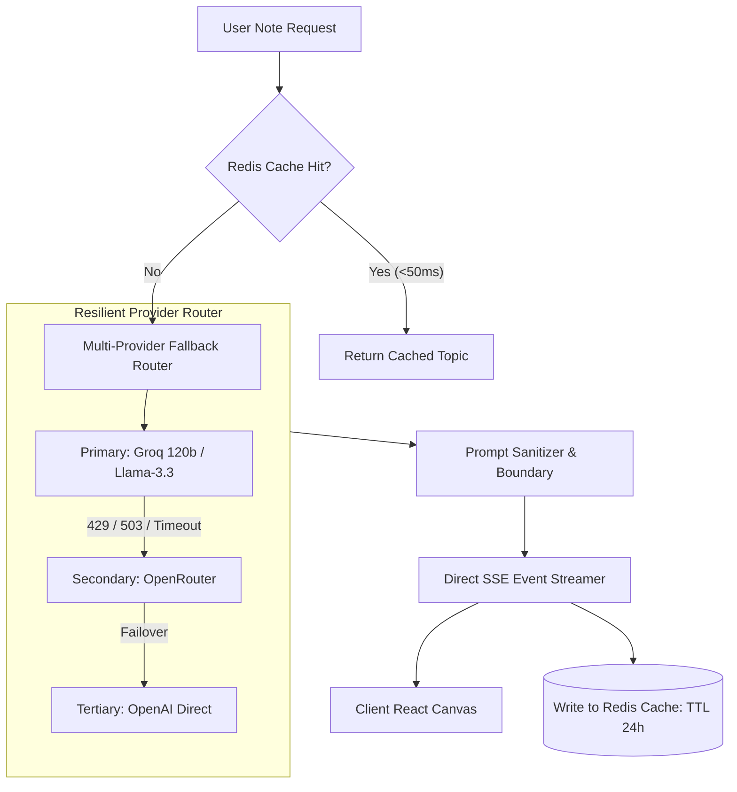

# Phase 1: AI Engine & Model Orchestration Hardening

## 1. Executive Summary & Goals
The objective of Phase 1 is to transform the prototype's AI inference layer into a resilient, high-speed, cost-effective LLM engine. We eliminate redundant framework dependencies, implement automatic multi-provider fallback routing, enforce strict prompt injection defenses, and add deterministic caching to eliminate redundant LLM calls.

---

## 2. Target Architecture



---

## 3. Concrete Implementation Milestones

### 1.1 Eliminate Framework Duplication (Retire LangChain)
* **Problem:** The codebase uses `@langchain/openai` (`server/services/structured.ts`) solely for structured output, while all streaming and generic completions use the AI SDK (`server/routes/stream.ts`, `server/routes/llm.ts`). This inflates bundle size and creates divergent retry and error models.
* **Action:**
  - Rewrite `server/services/structured.ts` to use AI SDK Core (`generateObject` with Zod schema validation) or unified language model factory.
  - Remove `@langchain/openai` from `package.json`.
  - Ensure uniform error classes (`LLMProviderError`, `LLMRateLimitError`, `SchemaValidationError`).

### 1.2 Multi-Provider Fallback Router
* **Problem:** If Groq or OpenRouter encounters a rate limit (429) or outage (503), the entire generation request fails and leaves the user with an error.
* **Action:**
  - Create `server/services/llm/fallbackRouter.ts`.
  - Define fallback chains based on configured API keys:
    1. Primary (Default configured in Settings)
    2. Fallback 1 (Alternative configured provider)
    3. Fallback 2 (Direct OpenAI / OpenRouter failover)
  - Automatically retry against the next provider when encountering network errors, 5xx server errors, or 429 rate limit errors.

### 1.3 Deterministic Redis Response Caching
* **Problem:** Identical queries (e.g. "Fundamental Rights in India") re-invoke the LLM every time, taking 15–25 seconds and burning upstream token budget.
* **Action:**
  - Create `server/services/cache/llmCache.ts`.
  - Generate deterministic SHA-256 cache key: `llm:topic:${category}:${normalizedTopic}:${hash(webContext)}`.
  - Cache validated topic JSON in Redis with 24-hour TTL.
  - Add bypass header/flag (`forceRefresh=true`) for users explicitly requesting fresh generation.

### 1.4 Token Budgeting & Dynamic Context Allocation
* **Problem:** Large web search results can overflow small context windows and incur excessive inference costs.
* **Action:**
  - Enforce token limits: Maximum 1,000 tokens allocated for web search context snippets.
  - Dynamically budget output tokens: `maxTokens = 3500` to prevent output cutoff on 5-part UPSC dossiers.

---

## 4. Detailed Task Checklist

- [x] Refactor `server/services/structured.ts` to standard AI SDK `generateObject`.
- [x] Uninstall `@langchain/openai` from `package.json`.
- [x] Create `server/services/llm/fallbackRouter.ts` with error-classification failover.
- [x] Implement Redis deterministic topic cache in `server/services/cache/llmCache.ts`.
- [x] Add `forceRefresh` query parameter support in `POST /api/generate` and `POST /api/generate/stream`.
- [x] Verify unit tests pass: `server/prompts/prompts.test.ts`, `server/services/structured.test.ts`, `fallbackRouter.test.ts`, `llmCache.test.ts`.
- [x] Verify `npm run lint` and `npm run build`.

---

## 5. Verification Commands
```bash
# 1. Lint check
npm run lint

# 2. Test LLM and prompt services
npx vitest run server/prompts/prompts.test.ts server/services/structured.test.ts

# 3. Full project build
npm run build
```
