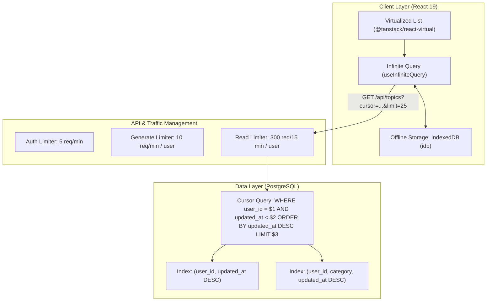

# Phase 3: Scalability, Concurrency & Data Throughput

## 1. Executive Summary & Goals
Phase 3 addresses database scalability, client storage bottlenecks, and concurrency controls. As study note collections grow into thousands of entries, monolithic JSON responses and browser `localStorage` limits (5MB) lead to memory crashes. We introduce cursor-based database pagination, migrate client offline caching to IndexedDB, virtualize long lists, and establish tiered rate limiting.

---

## 2. Target Architecture



---

## 3. Concrete Implementation Milestones

### 3.1 Cursor-Based Database Pagination
* **Problem:** `GET /api/topics` retrieves every single row in the database table and sends all full records in one monolithic array, causing high latency and memory pressure.
* **Action:**
  - Update `server/services/topics.ts`:
    - `listTopicsPaginated(userId, { cursor, limit, category, search })`
  - Return pagination envelope:
    ```json
    {
      "items": [...],
      "nextCursor": "2026-09-22T08:30:00.000Z",
      "hasMore": true,
      "totalCount": 1420
    }
    ```
  - Update client to use `@tanstack/react-query` `useInfiniteQuery`.

### 3.2 Client Offline Storage: Migrate to IndexedDB
* **Problem:** In `src/hooks/useTopics.ts`, `localStorage.setItem("ias_topics", JSON.stringify(items))` fails with `QuotaExceededError` once notes exceed 5MB.
* **Action:**
  - Install `idb` (lightweight promise-based IndexedDB wrapper).
  - Create `src/services/storage/idbTopics.ts`.
  - Seamlessly migrate existing notes from `localStorage` to IndexedDB on first launch, freeing browser storage and supporting 50MB+ collections.

### 3.3 Virtualized List Rendering
* **Problem:** Rendering hundreds of topic cards simultaneously in the DOM causes scroll jank and high memory consumption on mobile and low-power devices.
* **Action:**
  - Install `@tanstack/react-virtual`.
  - Refactor `src/pages/AllTopicsPage.tsx` and `src/components/TopicRow.tsx` to render only the visible viewport slice.

### 3.4 Tiered Rate Limiting by User & Endpoint
* **Problem:** A single global 100 req/15min limiter applies to all routes combined, keyed only by IP. An aggressive health check poll can block legitimate LLM generations.
* **Action:**
  - Refactor `server/utils/rateLimiter.ts`:
    - `authLimiter`: 5 attempts / minute by IP.
    - `generationLimiter`: 10 requests / minute keyed by `req.authUser.id`.
    - `readLimiter`: 300 requests / 15 minutes keyed by `req.authUser.id`.

---

## 4. Detailed Task Checklist

- [x] Add `listTopicsPaginated` in `server/services/topics.ts` with cursor pagination.
- [x] Add query indexes in `server/db/schema.ts` for `(userId, updatedAt)` and `(userId, category)`.
- [x] Update `GET /api/topics` endpoint with query parameters `limit`, `cursor`, `category`, `search`.
- [x] Install `idb` and create `src/services/storage/idbTopics.ts`.
- [x] Migrate `src/hooks/useTopics.ts` from `localStorage` to IndexedDB.
- [x] Install `@tanstack/react-virtual` and virtualize list rendering in `AllTopicsPage.tsx`.
- [x] Implement tiered Redis rate limiters in `server/utils/rateLimiter.ts`.
- [x] Run test suite: `npm test` and build check: `npm run build`.

---

## 5. Verification Commands
```bash
# 1. Lint check
npm run lint

# 2. Run unit tests
npm test

# 3. Test client build
npm run build
```
