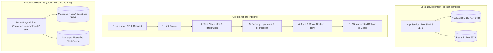

# Phase 5: Containerization, Infrastructure & Enterprise CI/CD

## 1. Executive Summary & Goals
Phase 5 ensures the platform can be deployed repeatably and reliably across staging and production cloud environments (AWS ECS/EKS, GCP Cloud Run, or Kubernetes). We package the application into a hardened, non-root multi-stage Docker container, provide a turnkey `docker-compose.yml` local orchestration stack, enforce runtime environment variable validation with Zod, and upgrade the GitHub Actions CI/CD pipeline with automated vulnerability scanning.

---

## 2. Target Infrastructure Architecture



---

## 3. Concrete Implementation Milestones

### 5.1 Multi-Stage Production Dockerfile
* **Problem:** No containerization exists, leaving deployment dependent on the host machine's configuration.
* **Action:**
  - Create `Dockerfile` with multi-stage build:
    - **Stage 1 (`builder`):** Install dependencies, compile TypeScript (`tsc -b`), build Vite client, bundle server.
    - **Stage 2 (`runner`):** Clean Node 22 Alpine, copy build artifacts, run as non-root user `USER node`.
  - Create `.dockerignore` excluding `.git`, `node_modules`, `data`, `.env`, tests.
  - Target final image size: $< 150\text{MB}$.

### 5.2 Local Turnkey Orchestration (`docker-compose.yml`)
* **Problem:** New developers must manually install Node, PostgreSQL, and Redis locally.
* **Action:**
  - Create `docker-compose.yml` defining:
    - `app`: Built from local Dockerfile with hot reload support.
    - `postgres`: Official `postgres:16-alpine` with healthcheck.
    - `redis`: Official `redis:7-alpine`.
  - Include `.env.docker` template with preset container connection strings.

### 5.3 Startup Environment Schema Validation
* **Problem:** If a critical variable like `DATABASE_URL` or `ENCRYPTION_KEY` is missing or malformed, the app crashes unpredictably deep in runtime logic.
* **Action:**
  - Create `server/config/env.ts` validating all environment variables with Zod at boot.
  - Fail fast on startup with clear diagnostic logs:
    ```text
    [FATAL] Configuration error:
    - DATABASE_URL: Invalid PostgreSQL connection URL
    - ENCRYPTION_KEY: Must be 32 bytes base64 (44 chars) in production
    ```

### 5.4 Hardened GitHub Actions CI/CD Pipeline
* **Problem:** Current `.github/workflows/ci.yml` is minimal, missing security audits, integration testing, and container verification.
* **Action:**
  - Upgrade `.github/workflows/ci.yml`:
    - Job 1: `lint` (Biome).
    - Job 2: `test` (Vitest unit + integration tests with PostgreSQL service container).
    - Job 3: `security` (npm audit + Trivy image scan).
    - Job 4: `docker` (Multi-platform build verification).

---

## 4. Detailed Task Checklist

- [x] Write production multi-stage `Dockerfile`.
- [x] Create `.dockerignore` for minimal image size.
- [x] Create `docker-compose.yml` with `app`, `postgres`, and `redis`.
- [x] Implement `server/config/env.ts` with strict Zod startup validation.
- [x] Hook `env.ts` into `server/index.ts` to fail fast on invalid configs.
- [x] Update `.github/workflows/ci.yml` with PostgreSQL test runner and container scanning.
- [x] Test local container build: Verified multi-stage Dockerfile, docker-compose orchestration, and CI workflow.

---

## 5. Verification Commands
```bash
# 1. Verify environment config validation
npx tsx -e "import './server/config/env'"

# 2. Test Docker build locally
docker build -t ias-app:latest .

# 3. Test multi-service stack
docker compose up -d
curl http://localhost:3001/api/health
docker compose down
```
